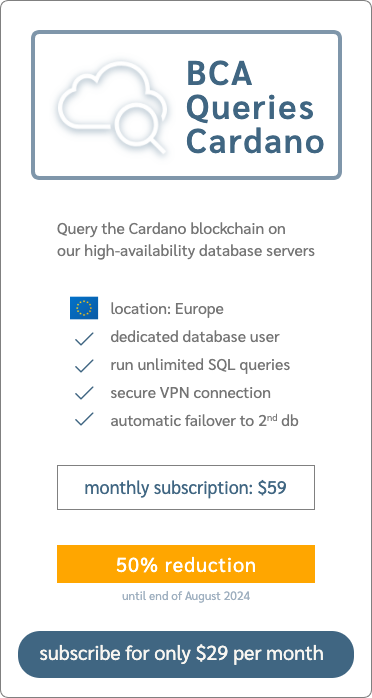
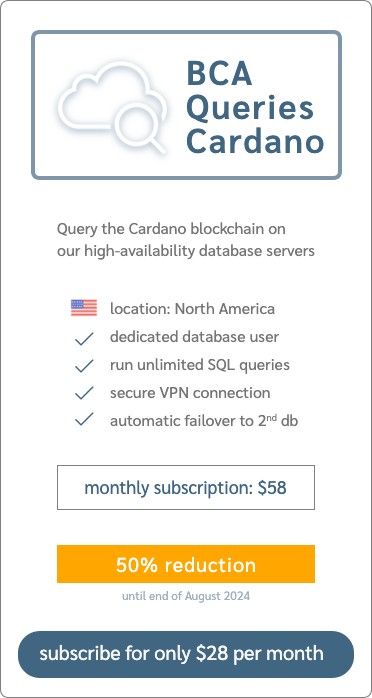

# Cardano Queries

<< documentation >>

## signup

> for a limited time until end of August 2024 we provide a **50% reduction** on the subscription fee

Depending on your location you may choose to connect to either:

| location | sponsorship tier | link |
|----|----|----|
| Europe 🇪🇺 |  $29 per month  | [select EU servers](https://github.com/sponsors/Blockchain-Data-Analytics/sponsorships?pay_prorated=true&tier_id=406906) |
| North America 🇺🇸  | $28 per month | [select US servers](https://github.com/sponsors/Blockchain-Data-Analytics/sponsorships?pay_prorated=true&tier_id=406907) |

Payment of the selected sponsorship gives you the right to use the service for up to a month. Renewal of the sponsorship extends the service period. Cancellation of your sponsorship will also terminate the service at the end of the paid period. Please understand that we cannot reimburse you.

We cannot provide you with a strict SLA. But, we promise to keep the services alive and fix technical problems asap. We have decent monitoring in place and will be able to react to service disruption.

See our [main page](https://github.com/Blockchain-Data-Analytics) for contact details.
