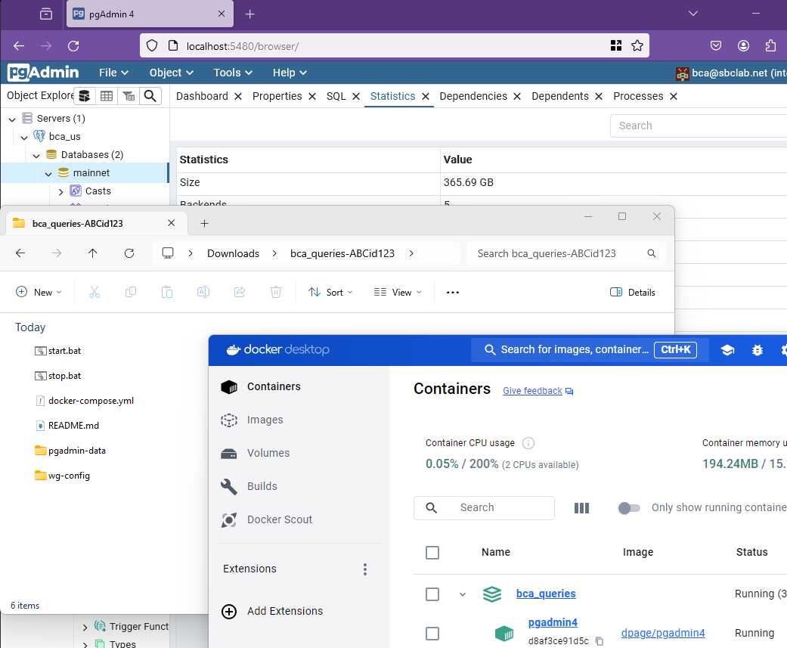

￪ [bach to main](00_main.md)

# Windows setup

## start the services with "start.bat"

The services are prepared and run. Also, check the Docker Desktop Dashboard for the running containers.

Connect to http://localhost:5480 to see the pgAdmin user interface.

## stop the services with "stop.bat"

The services are terminated.

