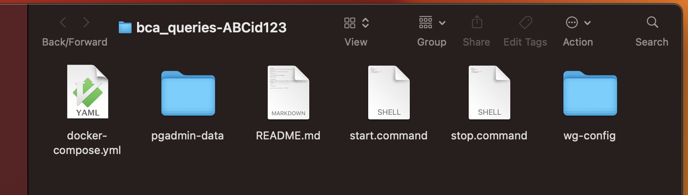
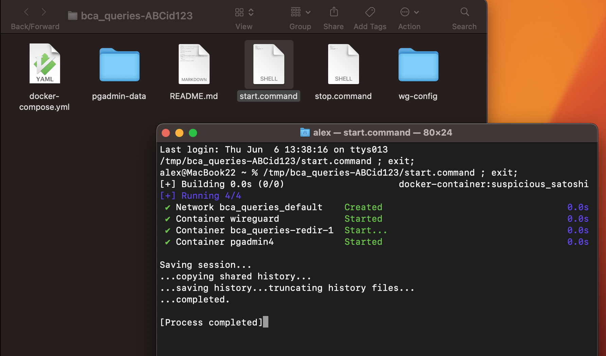
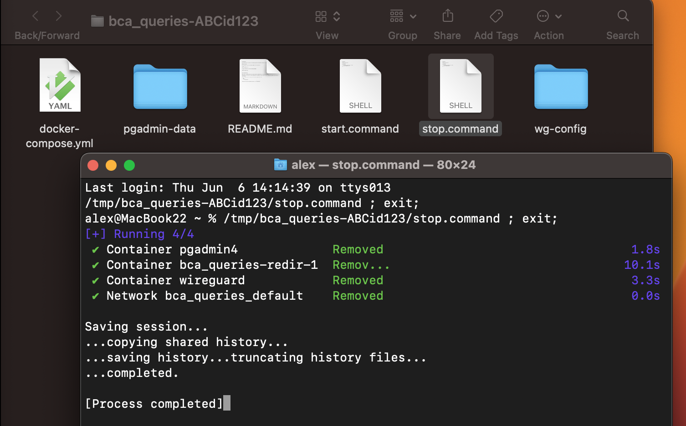

￪ [bach to main](00_main.md)

# Setup on macOS

## 1. extract the downloaded zip container

and open the folder in _Finder_

## 2. start the services with "start.command"

## 3. at some point, stop the services with "stop.command"

