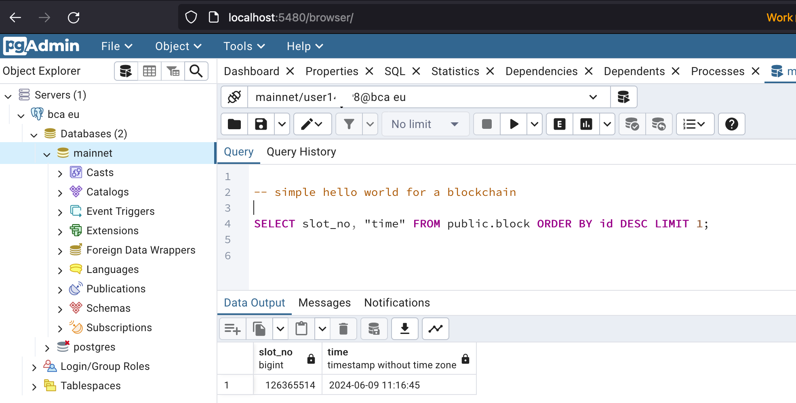

￪ [bach to main](00_main.md)


# Using _pgAdmin_

[pgAdmin](http://localhost:5480) is available locally at http://localhost:5480

let's write a simple "hello world" SQL query:

```sql
SELECT slot_no, "time" FROM public.block ORDER BY id DESC LIMIT 1;
```
(which outputs the slot number and block time of the latest block)


