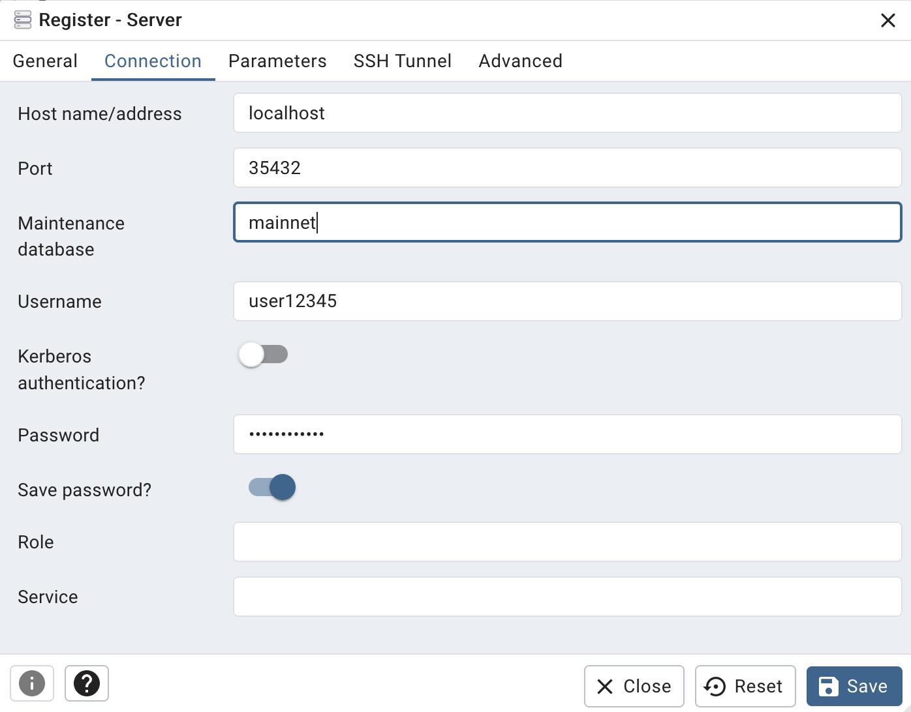

￪ [bach to main](00_main.md)

# Setup _pgAdmin_

[pgAdmin](http://localhost:5480) is available locally at http://localhost:5480

After login to _pgAdmin_ first create a connection to the database:

1. in the first tab give the server connect a name

2. in the second tab indicate how _pgAdmin_ connects to the database server

    2.1 Host name = **localhost**

    2.2 Port = **35432**

    2.3 Maintenance database = **mainnet**

    2.4 Username = <your db username>

    2.5 Password = <your db password>

    2.6 Save password? = yes, tick this one

Then, "save" these settings and the connection is ready. If you encounter errors, then most probably a wrong password was entered or the username does not match.

